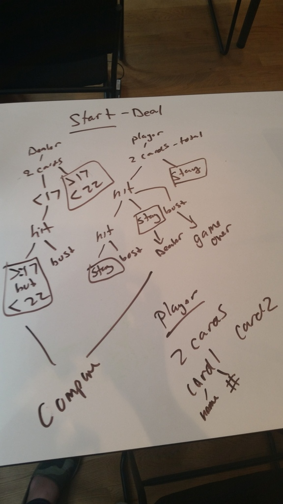

#General Assembly - Project one - Blackjack

Raina Koren
July 16, 2015

##Objective
To create a one-player blackjack game.

##Minimum Viable Product
A basic implementation of this project should probably include:

- A way to keep track of the current player bankroll ( a player should be able to play multiple hands and the bankroll should reflect wins and losses)
- A way for players to make a bet
- A way for players to get more cards, or declare themselves happy with their current hand
- A way for players to bust
- A way for players to win or tie
- Game logic for the dealer to hit until a certain point

##Initial Sketches for  Logic Organization

##Project Final Features
- A way to keep track of the current player bankroll - with many bugs but I was able to roll it over.
- A way for players to make a bet
- A way for players to get more cards, or declare themselves happy with their current hand - css issues
- A way for players to bust
- A way for players to win or tie
- Game logic for the dealer to hit until a certain point
- Blackjack result is there but not working
- Ability to play multiple hands works for the most part but results in an unknown bug and the css needs TLC.
